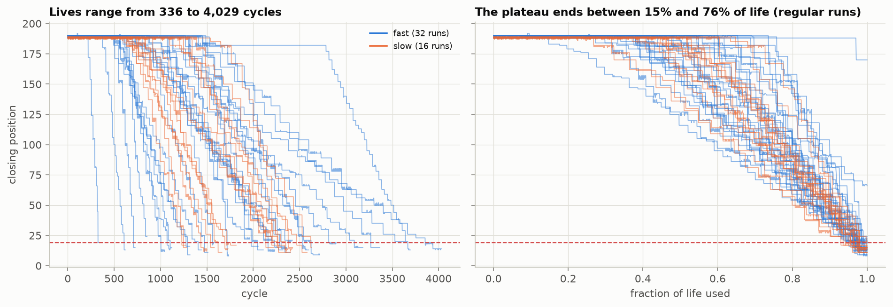
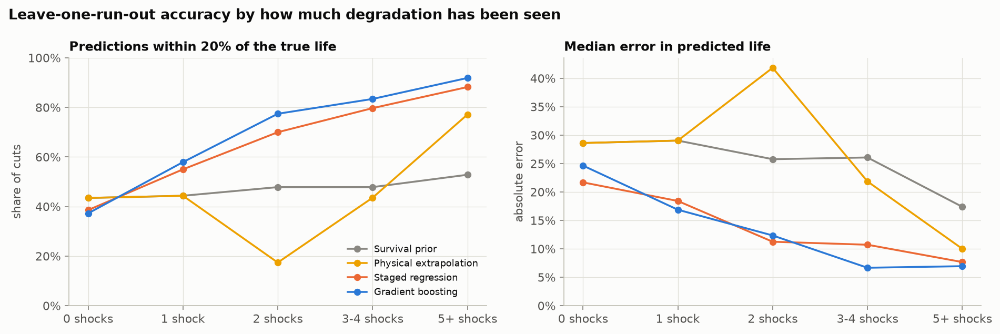
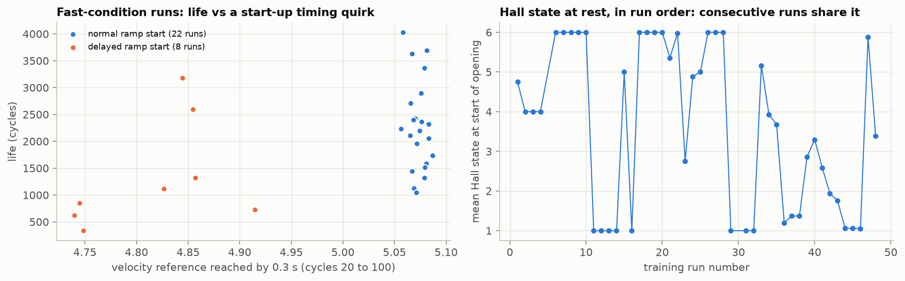

# Predicting the remaining life of a subway gate motor

Analysis and modelling of the [PHM Europe 2026 Data Challenge](https://data.phmsociety.org/phm-europe-2026-conference-data-challenge/) dataset: a servomotor opens and closes a subway ticket gate until it can no longer close, and the task is to predict how many cycles each test door has left.

## Links

- **Competition page and leaderboard:** https://data.phmsociety.org/phm-europe-2026-conference-data-challenge/
- **Dataset download (1.6 GB zip):** https://phm-datasets.s3.us-east-1.amazonaws.com/Data_Challenge_PHME2026_dataset.zip
- **Challenge description and data format (PDF):** https://data.phmsociety.org/wp-content/uploads/sites/9/2026/05/Data_Challenge_2026.pdf
- **Original study of the test bench:** Soualhi, Nguyen and Medjaher (2022), https://doi.org/10.1016/j.compind.2022.103766

## The question

Given the sensor recordings of a door up to some point in its life, how many more cycles will it run before it fails, and how confident can that estimate honestly be?

## Short answer

- Life can be predicted well **once the door has started to degrade**: after one step-drop in closing position, 58% of predictions are within 20% of the true life; after two, 77%; after five, 92%.
- **Before the first drop, it cannot.** No model beat the median life of comparable past runs on the challenge metric, and that guess is within 20% only 43% of the time.
- Most test runs are cut off in that early, hard regime (6 of 19 before any drop), which is why honest scores on this challenge sit far below 1.
- Early-cycle sensor features looked like an early warning. The apparent gain **did not survive a significance check**, so they are not in the model.

| | |
|---|---|
|  |  |

## 1. Exploratory analysis

Notebook: [notebooks/01_exploratory_analysis.ipynb](notebooks/01_exploratory_analysis.ipynb)

1. **The target is one number per run.** RUL in the training labels is a plain countdown of files remaining, in all 48 runs. Predicting RUL for every file is the same as predicting each run's total length.
2. **One signal carries the degradation.** Each file records only the first 0.3 s of a move, so the door's closing position can only be read from the start of the *next* opening file. That value sits at about 190 on a healthy door and reaches about 15 at failure.
3. **The door fails in steps, not gradually.** A long flat plateau (15% to 76% of life) is followed by a staircase of about 18 drops. Drops average 9 position units and their size does not depend on how degraded the door already is.
4. **Each run has its own pace.** After the first three or four drops, the interval between drops is constant within a run and ranges from 13 to 114 cycles between runs. It explains most of the life remaining after the first drop (Spearman 0.73).
5. **The test set sits in the hard regime.** Test runs are cut off early: 6 of 19 before any drop and 15 of 19 with four drops or fewer.
6. **The metric has a cliff.** Half of the score depends on staying within 20% from the very first file, so an error above 20% in predicted life collapses a run's score to about 0.25.

### Data quality notes

- Two channels (digital encoder, motor temperature) are zero throughout.
- Only two of the three documented operating conditions can be told apart from the recordings; the third differs in deceleration, which happens after the recording window ends.
- `Train_45` contains a stray folder that is a byte-identical copy of `Train_46`.
- `Train_5` and `Train_30` end well above the failure threshold and are excluded from training.
- In slow runs the recording sometimes starts after the door has begun to move, which makes the position read low. The health indicator uses the file maximum, and the step detector works on a 5-cycle rolling maximum with a 3-unit threshold. A first, more sensitive version of the detector reported false drops in the plateau of a few slow runs and was corrected.
- The test set has 19 runs; the challenge document says 18.
- The test archive preserves original file timestamps. They are used once, to convert cycles to seconds, and never as a model input.

## 2. Modelling

Notebook: [notebooks/02_modelling.ipynb](notebooks/02_modelling.ipynb)

**Setup.** Each of 46 complete runs is cut every 20 cycles, giving 4,436 examples of "run so far" and "life it eventually had". Features describe only the degradation staircase. Validation is leave-one-run-out, with every run weighted equally.

**Leave-one-run-out results**, for cuts in the region where test runs are cut. Share of predictions within 20% of the true life:

| Degradation seen | Survival prior | Physical extrapolation | Staged regression | Gradient boosting |
|---|---|---|---|---|
| 0 shocks | **43%** | 43% | 39% | 37% |
| 1 shock | 44% | 44% | 55% | **58%** |
| 2 shocks | 48% | 17% | 70% | **77%** |
| 3-4 shocks | 48% | 44% | 80% | **83%** |
| 5+ shocks | 53% | 77% | 88% | **92%** |

- The **final model** uses the survival prior before the first shock and gradient boosting after it. Its local challenge score, weighted by the stage mix of the test set, is 0.65, against 0.51 for the prior alone.
- **Naive physics is worse than a blind guess early on.** Extrapolating the shock rate overestimates life because the first intervals are longer than the steady ones. The learned models correct that bias.
- **Uncertainty is reported by stage.** On the plateau, 80% of true lives fall between 0.58 and 1.48 times the prediction; after three or four shocks, between 0.86 and 1.22.

### A lead that did not hold up

Adding seven sensor averages from cycles 20 to 100 appeared to improve plateau-stage accuracy from 37% to 46% within 20%. Resampling the 46 runs gives a 95% interval for that gain of about -1 to +18 points, which includes zero, and there is no gain at any later stage or on the challenge score.

There is a suggestive pattern behind it: eight fast-condition runs with a slightly delayed velocity ramp have a median life of 984 cycles against 2,215 for the rest, and the motor's resting Hall state is shared by blocks of consecutive runs. One reading is that runs were recorded in sessions with shared shock-injection settings, which would make this a batch effect and not a property of the door. That is a hypothesis: a direct test of whether neighbouring runs have similar lives gives a correlation of only 0.17 (p = 0.09). The features are left out of the main model.



## Limitations

- 46 independent runs is a small sample, so stage-level numbers carry real uncertainty.
- The challenge score is computed with a local reading of a formula the document leaves ambiguous in two places. It ranks models; it does not predict the leaderboard value.
- Degradation is injected by a script on a random schedule. "The plateau carries no warning" is a statement about this test bench, not about real wear.
- The model per stage was chosen with the same cross-validation that reports the scores, so 0.65 is slightly optimistic.
- Every result depends on the step detector. Its thresholds were set from the structure of the data, not tuned on model accuracy.

## Project layout

```
notebooks/01_exploratory_analysis.ipynb   data audit, health indicator, degradation pattern
notebooks/02_modelling.ipynb              baselines, models, validation, test predictions
notebooks/*.py                            plain-text source of each notebook
src/extract_features.py                   one row of summary features per measurement file
src/health.py                             health indicator and shock detection
src/prefix.py                             features of a run seen up to a cut-off; training examples
src/models.py                             models and leave-one-run-out harness
src/scoring.py                            local approximation of the challenge score
src/plotstyle.py                          shared figure style
results/submission.csv                    main submission (degradation features only)
results/submission_session_features.csv   experimental variant using early-cycle sensor features
results/test_predictions.csv              predicted life and 80% range per test run
results/loro_predictions.csv              every leave-one-run-out prediction
figures/                                  figures exported by the notebooks
data/                                     derived tables (rebuilt by the code, not committed)
```

## Reproducing

1. Download the [dataset zip](https://phm-datasets.s3.us-east-1.amazonaws.com/Data_Challenge_PHME2026_dataset.zip) from the [competition page](https://data.phmsociety.org/phm-europe-2026-conference-data-challenge/) and unpack it so that the project contains `Train/Train/Train_1 ...` and `phm2026data-test_date/Test/Test/Test_1 ...` (plus `phm2026data-test_date/Test.zip` for the timestamp check in notebook 1).
2. Install the requirements:
   ```
   python -m venv .venv
   .venv\Scripts\pip install -r requirements.txt
   ```
3. Build the feature tables (about one minute on 16 cores):
   ```
   .venv\Scripts\python src\extract_features.py
   ```
4. Run the notebooks in order. Notebook 2 builds the training examples on first run (about one minute) and takes a few minutes for the leave-one-run-out loop.

## Data

The dataset is published by the PHM Society for the [PHM Europe 2026 Data Challenge](https://data.phmsociety.org/phm-europe-2026-conference-data-challenge/) ([direct download](https://phm-datasets.s3.us-east-1.amazonaws.com/Data_Challenge_PHME2026_dataset.zip)) and comes from the PIMSSIS test bench described in Soualhi, Nguyen and Medjaher (2022), https://doi.org/10.1016/j.compind.2022.103766. The raw data (about 6 GB unpacked) is not included in this repository.
